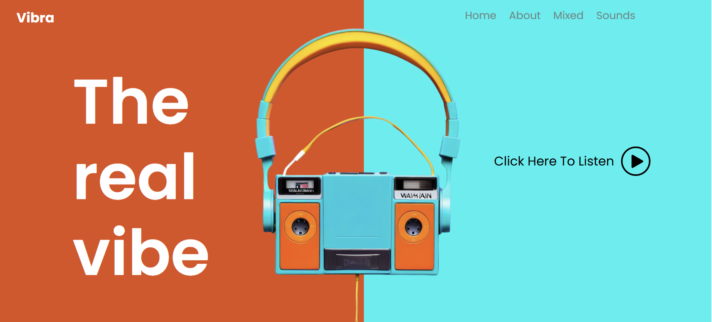

Vibra
Is a fictitious landing page designed to showcase interactive visual elements that respond to music. This project highlights the synergy between sound and visuals, creating an engaging user experience.

Features
🎨 Visual Interactivity: Dynamic animations that react to the rhythm of the music.
🎶 Minimalist Design: A clean, modern interface focused on the music.
⏱ Dynamic Interaction: Play or pause the music and watch the visuals respond in real-time.

Technologies Used
HTML
CSS
JavaScript

